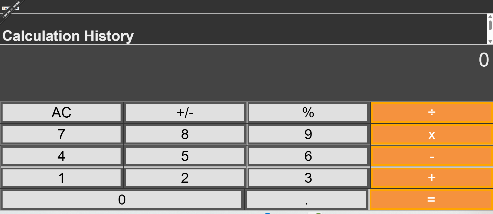
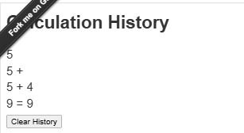

Calculator
---

Created with *create-react-app*. See the [full create-react-app guide](https://github.com/facebookincubator/create-react-app/blob/master/packages/react-scripts/template/README.md).

Try It
---

[ahfarmer.github.io/calculator](https://ahfarmer.github.io/calculator/)

Install
---

`npm install`

Usage
---

`npm start`

Original Functionality
---
The original calculator application provided basic arithmetic operations (+, -, ×, ÷) with a clear display and button panel.  Numbers could be entered and calculations performed sequentially.

Added Features
---

**Dark Theme Toggle:** A toggle switch allows users to switch between light and dark themes.  This improves usability in different lighting conditions.

**Calculation History:** A history panel displays a list of previous calculations, allowing users to review their work.  The history can be cleared with a dedicated button.

Implementation Process
---
The dark theme toggle was implemented using React's state management. A state variable tracks the current theme ("light" or "dark"), and this state is used to apply CSS classes that change the appearance of the calculator.  The calculation history was implemented by storing calculation strings in a state array.  Each calculation is added to the array as it's performed, and the array is rendered in a list.

Challenges Faced and Solutions
---
Initially, managing the state for both the calculation logic and the history presented some challenges.  The solution was to separate the state into distinct variables for the active calculation and the history, updating them independently.

Aider Commands Used and Their Effectiveness
---

1. **“Add a toggle button to switch between light and dark themes in App.js. Use a CSS class on the root div.”**
2. **“Modify the files so that the numbers are opposite the theme: when in dark mode, numbers and buttons switch to lighter colors.”**
3. **“Make sure button text and value colors update when toggling themes (AC, ÷, numbers 1–9, etc.).”**
4. **“Fix the layout in App.css so the calculator and history sections display properly without overflow.”**
5. **“Create a new React component called History.js that takes an array of calculation strings as a prop and displays them in a scrollable list.”**
6. **“In Calculator.js, maintain a `calculationHistory` state array and pass it to the History component; add new entries whenever a calculation runs.”**
7. **“Add a ‘Clear History’ button below the history list that resets the history array in state.”**
8. **“Refactor Calculator.js to use a reusable Button component to avoid repeating JSX for each number/operator button.”**
9. **“In App.js, fix the ReferenceError caused by calling `calculate()` before defining `total`, `next`, and `operation`; use the current state values instead.”**
10. **“In src/component/App.js, import `useState` from React, declare state hooks for `total`, `next`, `operation`, and `history`, and remove any accidental references to `window.history`.”**

